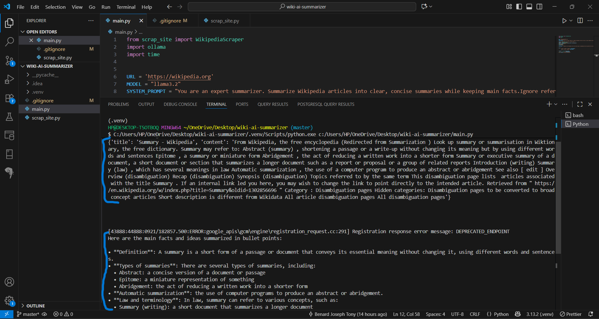

# Wikipedia Summarizer with LLM  

This project scrapes **Wikipedia articles** and generates clear, concise summaries using **Large Language Models (LLMs)**.  
It combines **Selenium + BeautifulSoup** for scraping and **Ollama** for local LLM inference.    

---

##  Features
- 🔎 Search Wikipedia directly from the script  
-  Clean extracted text (removes tables, images, nav, citations, etc.)  
-  Summarize with LLM (**Llama 3.2**)  
-  Outputs summaries in **bullet point format**  
- 🛠️ Modular code (`main.py` + `scrap_site.py`)  

---

## 📂 Project Structure
├── main.py # Main entry point: scraping + summarization
├── scrap_site.py # Wikipedia scraper class (Selenium + BeautifulSoup)
└── README.md # Project documentation


---

## ⚙️ Installation

1. **Clone this repo**
   ```bash
   git clone https://github.com/tonybenard/Wiki-AI-Summarizer.git
   cd Wiki-AI-Summarizer

---

## 🛠️ Tech Stack

Python 3.9+

Selenium – browser automation

BeautifulSoup4 – HTML parsing

Ollama – LLM inference (using Llama 3.2 in this project)

ChromeDriver – Selenium 

---

## 📌 Notes

This script opens a Chrome browser window to interact with Wikipedia.

Make sure Ollama is installed and running before executing.

Summaries are generated locally, so no external API calls.

---

## Sample



